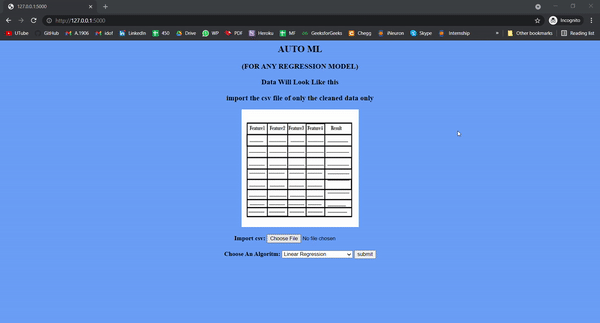

# Auto_Regression_Ml

 

## Project Objectives :
The objective of the project is to create a machine learning model. We are doing a supervised learning and our aim is to do get the accuracy score.

## Data :
User have to give the data to check accuracy & the data should be clean and don't have catagorical column 

## Modelling :
The analysis and model creation can be found in the app.py file. 

The main packages used are pandas , flask and sklearn .  

## Deployemnt :
The web app has been build using basic HTML, CSS, Flask and Herkou.

Link: https://auto-ml-regression.herokuapp.com/

## Future Scope :
* Use multiple Algorithms
* Update the Front-End 
